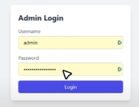
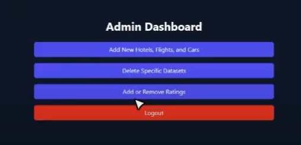
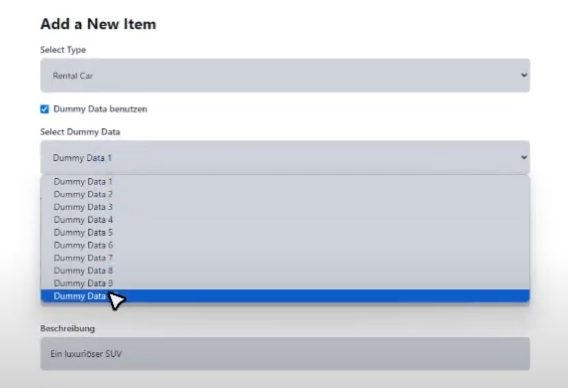
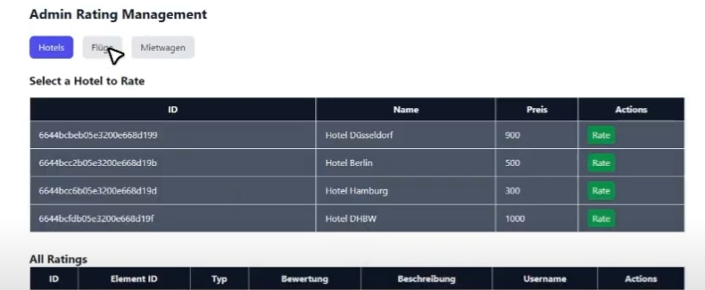
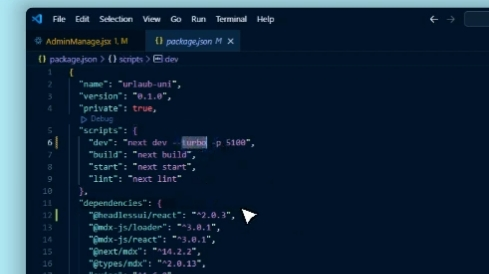

# Abgabe Verteile Systeme
Gruppe: Wael Alkahhaleh, Jan Hammer, Jan Hoang

## Inhaltsverzeichnis
1. [Erläuterung des Projekts](#Erläuterung-des-Projekts)
2. [Webhosting Vergleichstabelle](#Webhosting-Vergleichstabelle)
3. [Funktionalität der Webseite](#Funktionalität-der-Webseite)
	3.1 [Verwendete Tools](#Verwendete-Tools)
	3.2 [Einträge auf der Webseite](#Einträge-auf-der-Webseite)
	3.3 [Admin Zugang](#Admin-Zugang)
	3.4 [Admin Rating Management](#Admin-Rating-Management)
4. [Troubleshooting](#Troubleshooting)

# Erläuterung des Projekts
- <a href="https://youtu.be/UErumacYaVE" target="_blank">**Link**</a> zum Video-Showcase

# Webhosting Vergleichstabelle (inkl. Kostenvergleich)

| Anbieter          | Plan          | Preis/Monat | Speicherplatz | Webseiten  | SSL-Zertifikat | Support         |
|-------------------|---------------|-------------|---------------|------------|----------------|-----------------|
| Bluehost          | Choice Plus   | 5,09 €      | 50 GB         |  50        | Kostenlos      | 24/7 Support    |
| HostGator         | Baby Plan     | 3,26 €      | 20 GB         |  20        | Kostenlos      | 24/7 Support    |
| SiteGround        | StartUp       | 2,99 €      | 10 GB         |  1         | Kostenlos      | 24/7 Support    |
| A2 Hosting        | Startup       | 2,79 €      | 100 GB        |  1         | Kostenlos      | 24/7 Support    |
| InMotion Hosting  | Core          | 2,79 €      | 100 GB        |  2         | Kostenlos      | 24/7 Support    |
| GoDaddy           | Deluxe        | 6,99 €      | 50 GB         |  10        | Kostenlos      | 24/7 Support    |
| Strato            | Basic         | 9,00 €      | 100 GB        |  3         | Kostenlos      | 24/7 Support    |
| Hostinger         | Premium       | 2,79 €      | 100 GB        |  100       | Kostenlos      | 24/7 Support    |

# Funktionalität der Webseite
## Verwendete Tools
- **Anwendungen**: MongoDB Compass, Visual Studio Code
- **Front-End**: Next.js, Tailwind
- **Back-End**: MongoDB

## Einträge auf der Webseite
Einträge auf der Webseite bestehen aus folgenden Komponenten (am Beispiel Hotel):
- **Name**: Der Name des Hotels
- **Bewertung**: Bis zu 5 Sterne kann ein Eintrag verliehen bekommen
- **Beschreibung**: Ein Text, welcher den Eintrag beschreibt
- **Preis**: Der Preis des Hotels
- **Review-Button**: Die Schaltfläche führt den Nutzer zum Textfeld, um eine Bewertung schreiben zu können

## Admin Zugang
- Pseudo-Login mit Username "admin" und Passwort "Sicherespasswort"

- Admin kann Einträge hinzufügen oder Löschungen vornehmen
	- **Neue Einträge**: Klicke auf "Add New Hotels, Flights, and Cars"
	- **Bestehende Einträge löschen**: Klicke auf "Delete Specific Datasets"
	- **Bewertungen hinzufügen oder entfernen**: Klicke auf "Add or Remove Ratings"

- Um zum testen schneller Einträge erstellen zu können, einen Haken bei "Dummy Data benutzen" setzen und vorgefertigte Werte erhalten. Alternativ können die Felder natürlich auch manuell ausgefüllt werden.
	- Wähle im Dropdown-Menü unter "Select Dummy Data" den gewünschten Dummy-Datensatz aus
	- Beschreibungen und Details der Dummy-Daten werden automatisch ausgefüllt

## Admin Rating Management
Die Admin Rating Management Seite ermöglicht es dem Administrator, Bewertungen und Einträge für verschiedene Kategorien wie Hotels, Flüge und Mietwagen zu verwalten. Es gibt eine klare Struktur zur Auswahl eines zu bewertenden Elements und eine Übersicht aller bereits vorhandenen Bewertungen. Die Schaltflächen und Tabellen sind intuitiv gestaltet, um eine einfache Navigation und Verwaltung zu ermöglichen.
- Im Navigationsbereich sind 3 Schaltflächen, um zwischen den jeweiligen Kategorien zu wechseln
- Tabelle (am Beispiel Hotel):
	- Spalten: 
		- **ID**: Die eindeutige Kennung des Hotels
		- **Name**: Name des Hotels
		- **Preis**: Preis des Hotels
		- **Actions**: Aktionen ausführen, wie bspw. Bewertung verwalten oder löschen

- User der Webseite sind in ihren möglichen Aktionen auf das **Aufrufen** und **Bewerten** von Einträgen im Gegensatz zum Admin reduziert.

# Troubleshooting
- Wenn npm run dev nicht funktioniert: 
	- Bei package.json bei "dev" unter "scripts" aus "next dev --turbo -p 5100" den "--turbo" flag entfernen und erneut ausführen
	
	

	- Überprüfe, ob alle Abhängigkeiten installiert sind
	- Sicherstellen, dass keine Prozesse gegenseitig ihre Ports blockieeren
	- Rechner neustarten, um sicherzustellen, dass keine anderen Anwendungen den Start von next dev behindern
